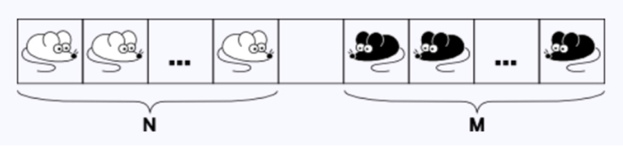
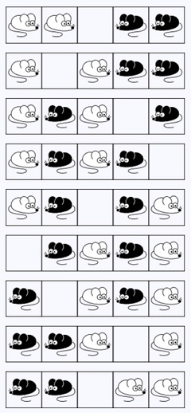
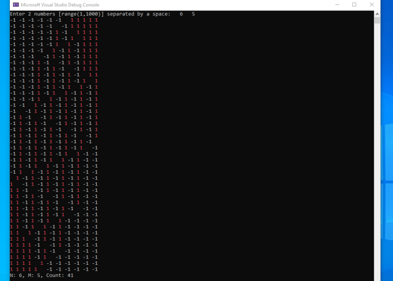

# ConsoleApp + Alghoritms

## Task 4
 Тошик проснулся ночью с жаждой охоты. Наловив N белых и M черных мышей, он принес их утром хозяйке. Ожидая, когда она проснется и порадуется, он разложил их следующим образом:

Его хозяйка очень любит поспать. Тошик заскучал и решил переложить мышей так, чтобы черные лежали слева, а белые справа. При этом он соблюдает следующие правила перекладывания:

    ●        Белую мышь можно переложить на соседнюю от нее справа клетку, если она не занята
    ●        Черную мышь можно переложить на соседнюю от нее слева клетку, если она не занята
    ●        Белую мышь можно переложить через одну черную на свободную клетку справа от нее
    ●        Черную мышь можно переложить через одну белую на свободную клетку слева от нее

Тошик, как и всякий кот, ленив, и поэтому он хочет поменять мышей местами за наименьшее число перекладываний. Ниже приведена оптимальная последовательность перекладываний для случая **N = M = 2**.

В данном случае Тошику потребовалось 8 перекладываний.
Напишите программу, которая находит минимальное число перекладываний, необходимых, чтобы поменять местами N белых и M черных мышей.

### Sample input I
     2 2
### Sample output I
     8
### Sample input II
     1 3
### Sample output II
     7

## Solution Screen
