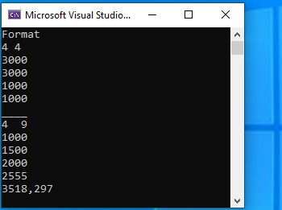
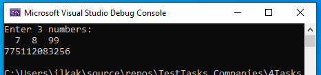

# ConsoleApp + Alghoritms

## Task 2
Шины, установленные на одном и той же автомобиле, могут изнашиваться с различной скоростью в зависимости от позиции шин. Например, шины на ведущих колесах обычно изнашиваются быстрее, чем шины на ведомых колесах. Эту проблему обычно решают, переставляя шины время от времени.

Допустим, что автомобиль имеет **N** колес и имеется **M** новых шин (шины одинаковые). Кроме того, для каждого колеса известна скорость износа шины на этом колесе. Напишите программу, которая определяет сколько максимально может проехать автомобиль, если перестановку шин производить оптимально. Вы можете предполагать, что шины изнашиваются равномерно и автомобиль движется прямолинейно.
### Input
В первой строке содержатся два целых числа **N** (**4 ≤ N ≤ 10, N** четное) и **M** (**N ≤ M ≤ 20**).
Далее следуют **N** строк, **i**-ая строка содержит одно целое число **a[i]** (**0 < a[i] ≤ 3000**). Новая шина, установленная на i-том колесе, полностью изнашивается через **a[i]** километров.
### Output
Вывести максимальное число километров, которые может проехать автомобиль, округленное до трех знаков после запятой.
### Sample input I
     4 4
     3000
     3000
     1000
     1000
### Sample output I
     1500.000
Шины на колесах 3 и 4 изнашиваются в три раза быстрее, чем шины на колесах 1 и 2. Через 750 колиметров надо поменять местами шины на колесах 1 и 3, а также шины на колесах 2 и 4.
### Sample input II
     4 6
     2000
     2000
     1000
     1000
### Sample output II
     2000.000
Шины на колесах 3 и 4 изнашиваются в два раза быстрее, чем шины на колесах 1 и 2. При этом имеются две запасные шины. Через 1000 колиметров надо заменить изношенные шины на колесах 3 и 4.

#### Solution Screen

____________________

## Task 3
 Даны различные натуральные числа **А, В, N: 1 < А, B < 10, 10 < N < 100**.
Сумма нескольких чисел равна **N**, каждое из чисел равно **А** или **B**.
Найти наибольшее возможное значение произведения этих чисел. Если такая ситуация невозможна, то вывести 0.

### Sample input I
     3 4 12
### Sample output I
     81
### Sample input II
     3 5 13
### Sample output II
     75

#### Solution Screen

__________________

## Task 4
 Тошик проснулся ночью с жаждой охоты. Наловив N белых и M черных мышей, он принес их утром хозяйке. Ожидая, когда она проснется и порадуется, он разложил их следующим образом:

Его хозяйка очень любит поспать. Тошик заскучал и решил переложить мышей так, чтобы черные лежали слева, а белые справа. При этом он соблюдает следующие правила перекладывания:

    ●        Белую мышь можно переложить на соседнюю от нее справа клетку, если она не занята
    ●        Черную мышь можно переложить на соседнюю от нее слева клетку, если она не занята
    ●        Белую мышь можно переложить через одну черную на свободную клетку справа от нее
    ●        Черную мышь можно переложить через одну белую на свободную клетку слева от нее

Тошик, как и всякий кот, ленив, и поэтому он хочет поменять мышей местами за наименьшее число перекладываний. Ниже приведена оптимальная последовательность перекладываний для случая **N = M = 2**.

В данном случае Тошику потребовалось 8 перекладываний.
Напишите программу, которая находит минимальное число перекладываний, необходимых, чтобы поменять местами N белых и M черных мышей.

### Sample input I
     2 2
### Sample output I
     8
### Sample input II
     1 3
### Sample output II
     7

#### Solution Screen
