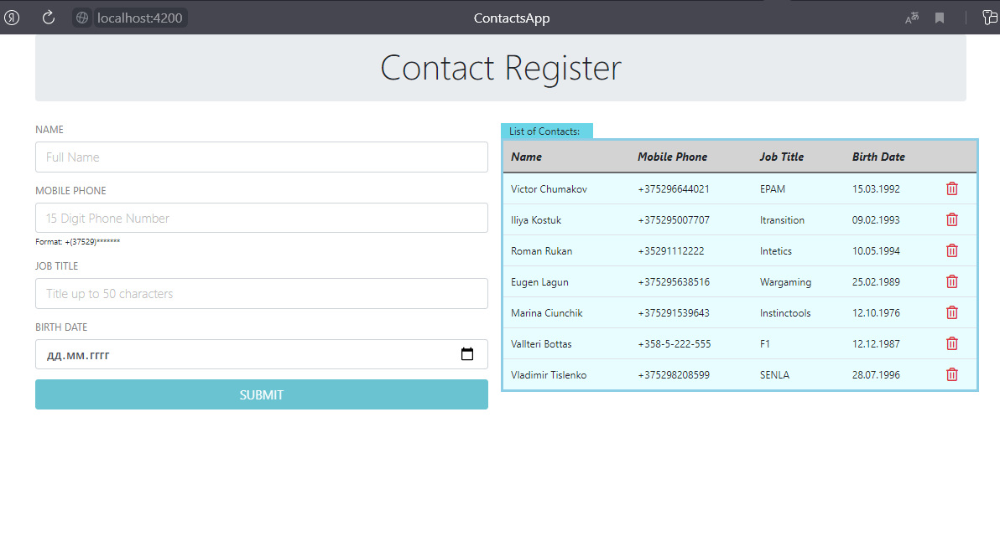

# Angular12 + .NET WebAPI

Разработать ASP.NET веб-приложение с одной страницей, на которой отображать список Контактов с возможностью добавления, изменения, удаления контактов. Список Контактов брать из локальной базы данных.

- Логика приложения:

-- Логика на стороне сервера приложения:
Реализовать логику CRUD (создания, изменения, удаления и чтение) сущности контактов.

Основные свойства Контакта, следуемые использовать для выполнения домашнего задания:
1. Name
2. MobilePhone
4. JobTitle
5. BirthDate

-- Логика на стороне пользовательского интерфейса:
Следует разработать web-страницу, на которой будет отображаться список Контактов, при выборе контакта должна появляться возможность изменять значение его свойств, а также должна быть возможность создания и удаление Контактов.

