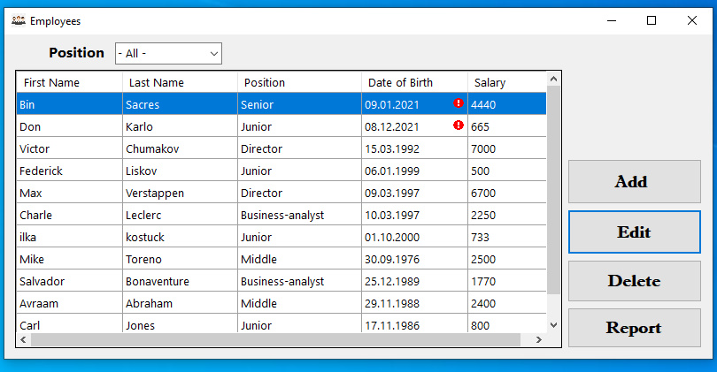

# WinForms + ADO.NET
Необходимо разработать:

1. Структуру данных для отображения следующей информации:
- Имя;
- Фамилия;
- Должность;
- Год рождения;
- Зарплата.
2. Форму «Сотрудники»:
Внизу расположить таблицу, на которой будет отображена вся информация (Имя, Фамилия, Должность, Год рождения, зарплата);
Вверху расположить фильтр, который позволит фильтровать информацию по должности;
Справа расположить группу кнопок:

                i.    Добавить сотрудника (с помощью которой можно будет добавлять информацию в таблицу);
               ii.    Удалить сотрудника;
              iii.    Отчет (по нажатию на которую, необходимо будет отобразить отчет);

3. Отчет, желательно с помощью SSRS, но можно и просто в Excel, который будет показывать среднюю зарплату для каждой должности.
4. Технические требования:
    - Winforms;
    - Язык разработки: С#, VB.NET;
    - База данных SQL Server (2008 и выше);
    - Доступ к базе осуществлять через ADO.NET.

