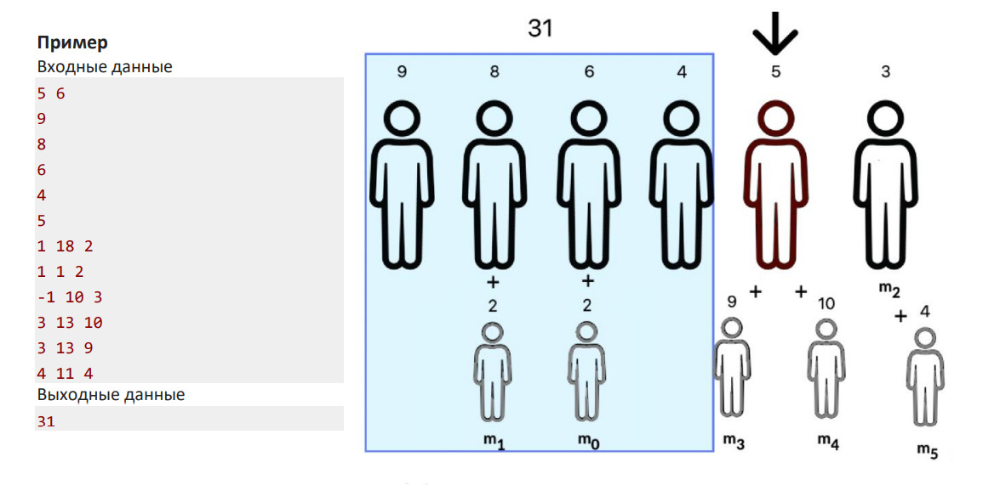
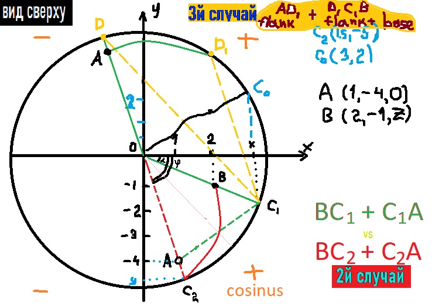

# Задача A. Столовая (часть 2)

Некоторое время назад Ада узнала о языке программирования Ada и решила связать свою жизнь с программированием. Будучи студенткой она пошла на курсы Wargaming Forge, после которых попала на стажировку в компанию Wargaming. В первый рабочий день Ада решила внимательно изучить офис компании. Начала она с корпоративной столовой: придя туда записала сколько человек стояло в очереди до нее, сколько времени требуется на обслуживание каждого сотрудника, сколько человек пришло после нее и куда они становились (некоторые люди могли стать не в конец очереди, а к своему коллеге, уже стоящему в очереди, и тем самым увеличить время обслуживания этого коллеги, так как теперь они будут обслуживаться вместе). По этим записям попробуйте определить, сколько же времени Ада стояла в очереди в столовой.

#### Входные данные
В первой строке входных данных содержатся через пробел два целых числа 𝑛 и 𝑚 (1 ≤ 𝑛 ≤ 10^4, 0 ≤ 𝑚 ≤ 10^4) –
количество человек в очереди в момент прихода Ады (включая ее) и количество человек, которые пришли после
нее. Далее в каждой из 𝑛 строк идет целое число 𝑡𝑖 (0 ≤ 𝑡𝑖 ≤ 10^5, 0 ≤ 𝑖 < 𝑛) – время обслуживания 𝑖-ого человека 
в очереди. В следующих 𝑚 строках через пробел указаны три целых числа 𝑎𝑗, 𝑠𝑗 и 𝑇𝑗 (−1 ≤ 𝑎𝑗 < 𝑛 + 𝑚, 0 ≤ 𝑠𝑗 ≤ 10^5
, 0 ≤ 𝑇𝑗 ≤ 10^5, 1 ≤ 𝑗 ≤ 𝑚), где 𝑠𝑗 – время, через которое пришел новый человек после Ады, 𝑇𝑗 – его время 
обслуживания, 𝑎𝑗 – номер человека (или группы, когда кто-то становится в очереди к своему коллеге, они 
обслуживаются вместе и считаются как одно целое, при этом время обслуживания такой группы – это сумма 
времен обслуживания каждого человека в группе) в очереди к кому пришедший присоединяется (считается по 
состоянию очереди на момент присоединения с 0). Если 𝑎𝑗 = −1, то новый человек становится в конец очереди. 
Будем считать, что пока кого-то обслуживают, он еще стоит в очереди.

#### Выходные данные
Выведите единственное число: время ожидания Ады в очереди без учета времени ее обслуживания.

____________________

# Задача B. Домашнее задание
На стажировке в Wargaming Ада хочет разобраться с новой игрой, поэтому ей нужно как можно быстрее сделать
домашнее задание по геометрии, которое задали в университете. В этом задании требуется найти кратчайшее 
расстояние по поверхности между двумя точками на поверхности конуса. Помогите Аде найти это расстояние.

#### Входные данные
В первой строке входных данных содержатся через пробел два целых числа 𝑟 и ℎ (1 ≤ 𝑟 ≤ 10^3, 1 ≤ ℎ ≤ 10^3) 
– радиус основания и высота конуса соответственно. Во второй и третьей строках записаны через пробел
координаты двух точек на поверхности конуса – по три действительных числа. Сам конус задан в декартовой 
системе координат, где начало координат находится в центре основания конуса, а ось 𝑂𝑍 идет по его оси 
вращения. Таким образом, вершина конуса имеет координаты (0,0, ℎ), а его основание лежит в плоскости 𝑋𝑂𝑌.
#### Выходные данные
Выведите длину кратчайшего пути по поверхности конуса между заданными точками с точностью в 8 знаков 
после запятой.

### Sample input I
     1   1
     0.0   0.5   0.0
     0.0   -0.5   0.0
### Sample output I
     1.00000000

### Sample input II
     1   2
     1.0   0.0   0.0
     0.0   0.0   2.0
### Sample output II
     2.23606798

#### Solution Screen

____________________

# Задача C. Лифты
 Через какое-то время после начала работы Ада заметила, что в офисе Wargaming во время обеда лифты не справляются с потоком людей. В это время все едут на первый этаж, где расположена столовая. Ада решила, что она сможет улучшить алгоритм работы лифтов. Помогите ей это сделать. Опишем схему работы лифтов в офисе. Все они разделены на пары. Каждая пара лифтов возит пассажиров только между двумя конкретными этажами, причем один лифт едет только вниз, а второй только вверх. Каждый лифт доставляет пассажиров от одного этажа до другого за одну единицу времени, а также мгновенно возвращается назад (в обратную сторону лифт не может никого везти). Между двумя этажами может быть несколько пар лифтов. Известно, что с любого этажа на любой можно (пусть и с пересадками) доехать. Пусть в какой-то момент времени 𝑘 сотрудников компании с разных этажей решили спуститься в столовую. Каждый сотрудник может либо подождать одну единицу времени на текущем этаже, либо поехать на лифте на другой этаж. Обозначим через 𝐴 суммарное время спуска на первый этаж всех сотрудников, а через 𝐵 – суммарную весовую нагрузку всех лифтов: она равна сумме квадратов количеств находящихся в лифте людей для каждой поездки лифта между этажами.

#### Входные данные
В первой строке входных данных содержатся через пробел пять целых чисел 𝑛, 𝑚, 𝑘, 𝑎 и 𝑏 
(2 ≤ 𝑛 ≤ 50, 𝑛 − 1 ≤ 𝑚 ≤ 50, 1 ≤ 𝑘 ≤ 50, 1 ≤ 𝑎 ≤ 50, 1 ≤ 𝑏 ≤ 50) – количество этажей, количество 
пар лифтов, количество сотрудников и две константы. Вторая строка через пробел содержит 𝑘 целых чисел 𝑓𝑖
(2 ≤ 𝑓𝑖 ≤ 𝑛, 1 ≤ 𝑖 ≤ 𝑘) – этажи, на которых находятся сотрудники в начальный момент. На каждом этаже могут
находиться несколько сотрудников. Далее следует 𝑚 строк с двумя целыми числами (через пробел) 𝑐𝑗 и 𝑑𝑗
(1 ≤ 𝑐𝑗 ≤ 𝑛, 1 ≤ 𝑑𝑗 ≤ 𝑛, 𝑐𝑗 ≠ 𝑑𝑗, 1 ≤ 𝑗 ≤ 𝑚) – номера этажей, между которыми ездит 𝑗-я пара лифтов.
#### Выходные данные
Выведите минимальное значение величины 𝑎𝐴 + 𝑏𝐵.

### Sample input
     3  2  4  1  1
     2  2  3  3
     1  2
     2  3
### Sample output
     15

__________________

# Задача D. Книги
Ада продолжает изучение офиса. На одном из этажей она нашла большую комнату для отдыха, в которой среди прочего находились полки для книг. Они используются для обмена книгами между сотрудниками компании.Ада заметила, что приходящие в эту комнату люди либо приносят ровно одну книгу на полку, либо забирают ровно одну книгу почитать, либо приходят по другим делам. Также Ада обратила внимание, что за время ее нахождения там, в комнату заходили 𝑛 ее коллег. Ей стало интересно, а сколько существует различных комбинаций из тех, кто принес книгу, унес и заходил по другим делам?
#### Входные данные
В первой строке входных данных содержатся через пробел четыре целых чисел **𝑛, 𝑝, 𝑎** и **𝑏 
(1 ≤ 𝑛 ≤ 3 × 10^5, 1 ≤ 𝑝 < 2^31, 0 ≤ 𝑎 ≤ 𝑏 ≤ 𝑛).** 

#### Выходные данные
Выведите количество различных комбинаций из 𝑛 человек, которые заходя в комнату с пустой полкой для книг, 
оставят после себя от 𝑎 до 𝑏 книг включительно. Так как это число может быть довольно большим, выведите 
его по модулю 𝑝. Две комбинации из 𝑛 людей называются различными, если хотя бы в одной позиции там 
находятся люди из разных групп – приносящих книгу, уносящих и остальных.

### Sample input
     3  100  1  3
### Sample output
     9

#### Примечание
В примере отдельно посчитаем комбинации для каждого количества оставшихся книг. И обозначим через П
того, кто приносил книгу, У – уносил, Д – приходил по другим делам. Тогда три книги могли остаться только 
если все приносили по книге (*ППП*). Две книги могли быть в случае, когда два человека приносили книги, а 
третий по другим делам заходил (*ДПП, ПДП, ППД*). Одна книга могла остаться либо когда принесли две книги 
и одну унесли (*ПУП, ППУ*), либо когда кто-то принес одну книгу, а остальные люди заходили по другим делам 
(*ПДД, ДПД, ДДП*). Итого получаем 9 комбинаций.
